# 📊 BeatSync アクティビティ図

## メインフロー

### 1. アプリケーション起動フロー

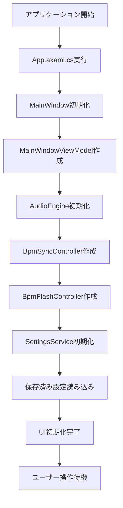

### 2. 音楽ファイル読み込みフロー

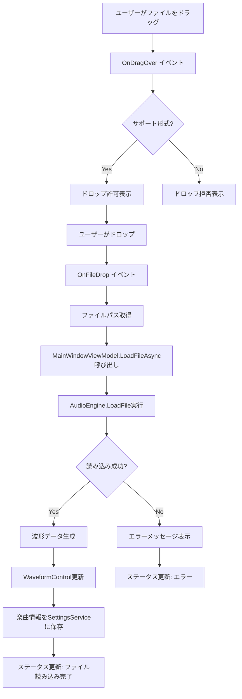

### 3. BPM設定と同期開始フロー

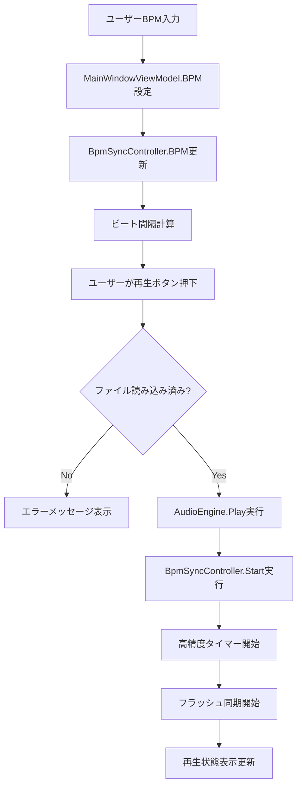

### 4. BPM同期フラッシュフロー

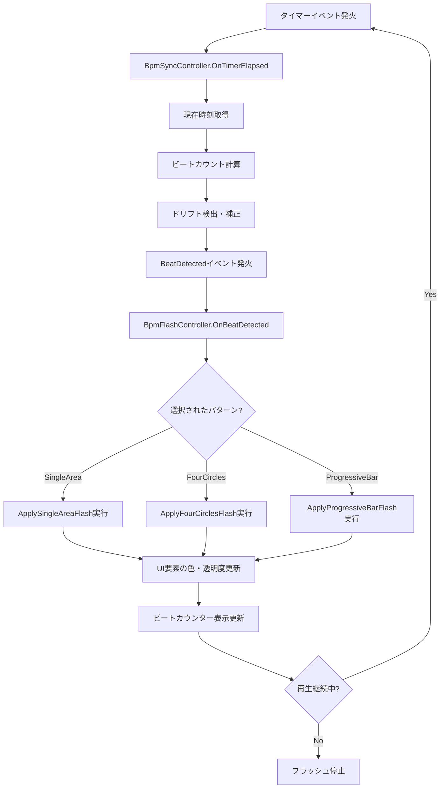

### 5. 楽曲情報保存フロー

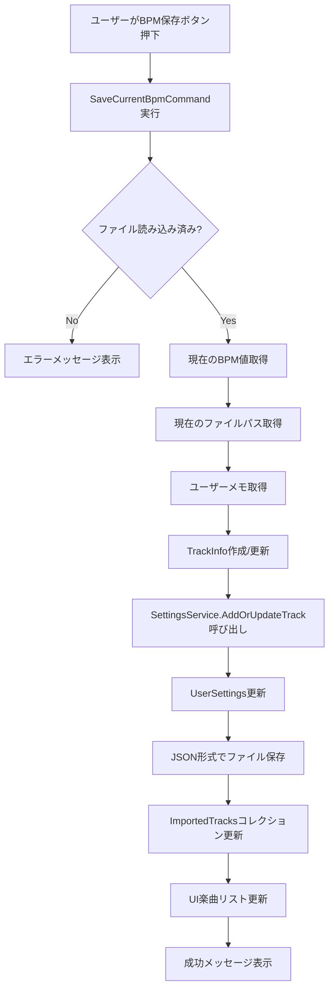

### 6. 保存済み楽曲読み込みフロー

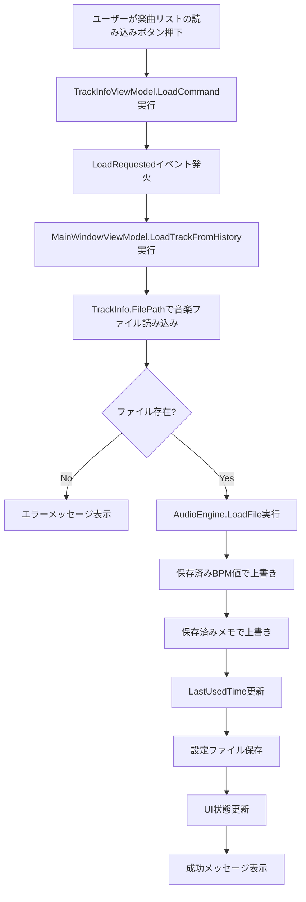

### 7. 全画面モードフロー

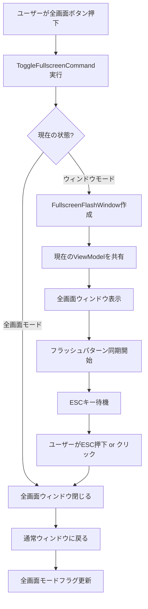

## エラーハンドリングフロー

### 1. ファイル読み込みエラー処理

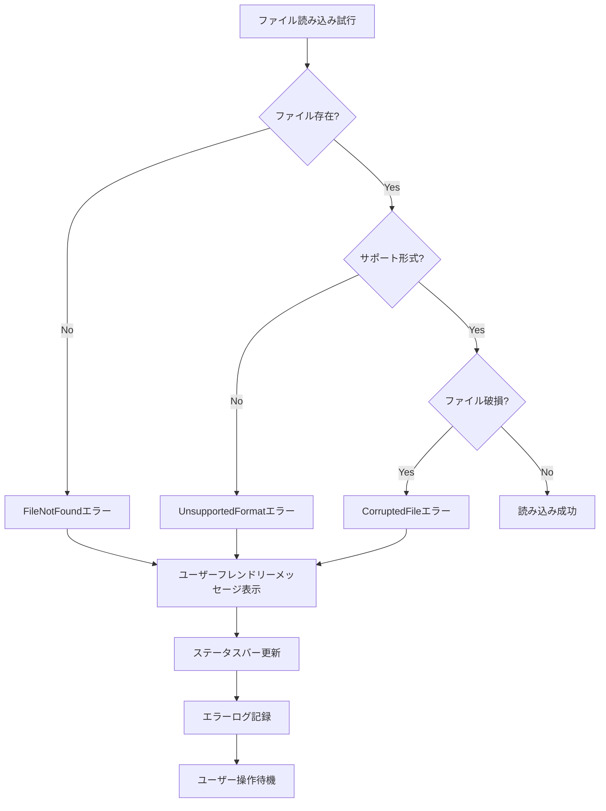

### 2. 音声再生エラー処理

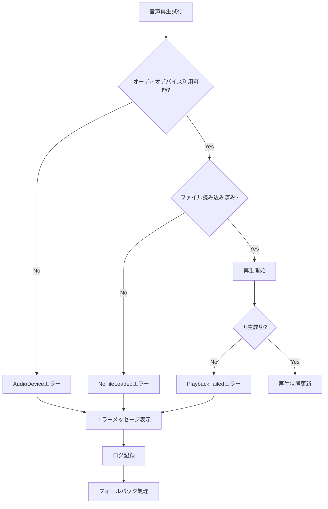

## パフォーマンス最適化フロー

### 1. 波形データ生成最適化

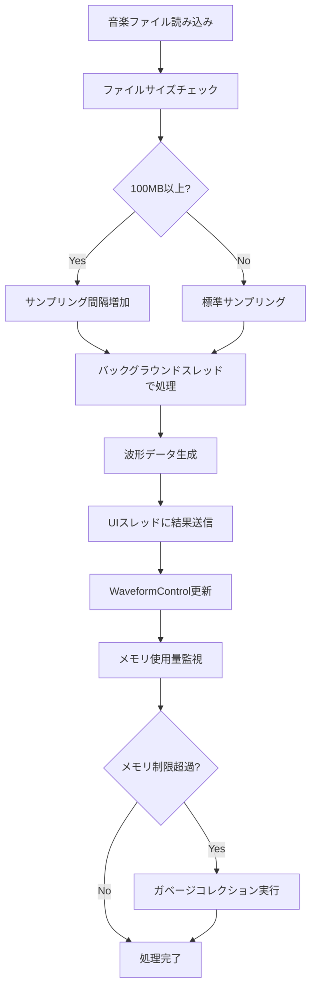

### 2. 同期精度最適化

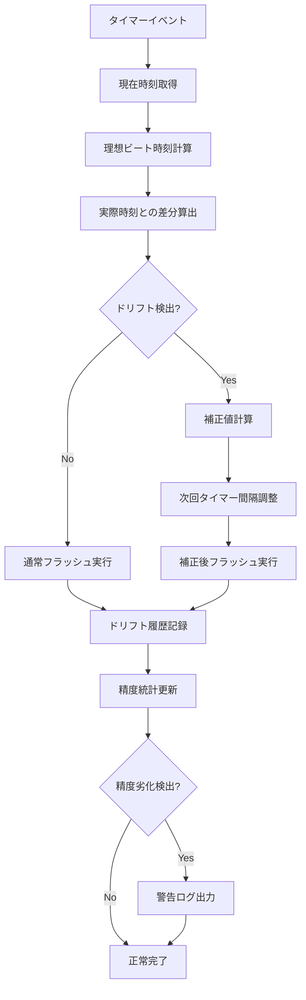

## 設定管理フロー

### 1. 設定保存フロー

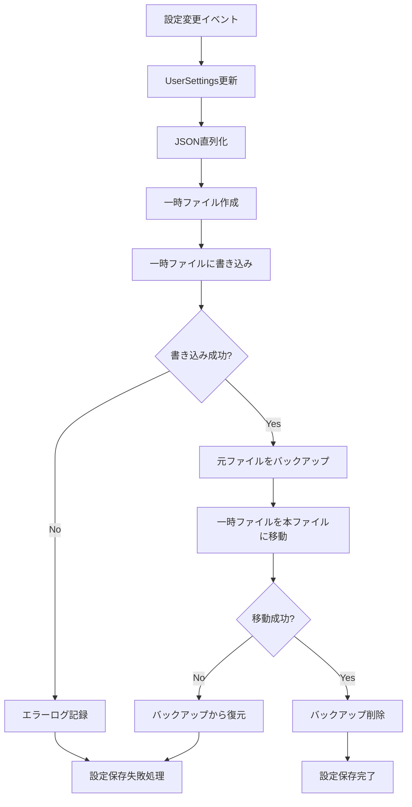

### 2. 設定読み込みフロー

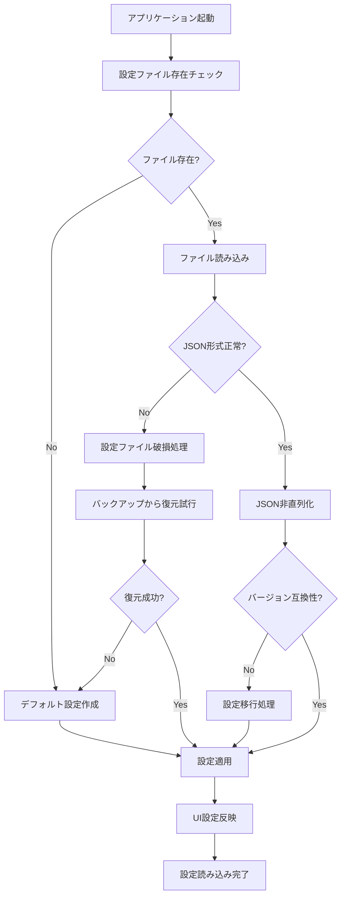

## ライフサイクル管理

### 1. アプリケーション終了フロー

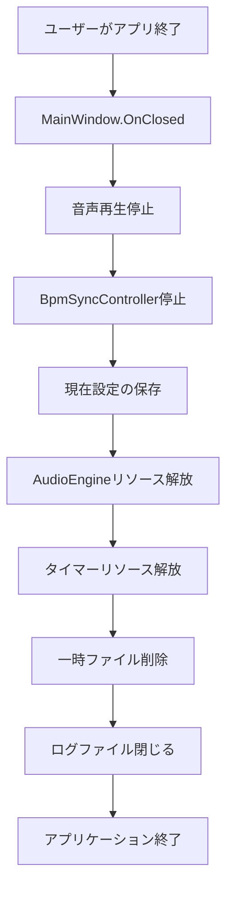

### 2. メモリ管理フロー

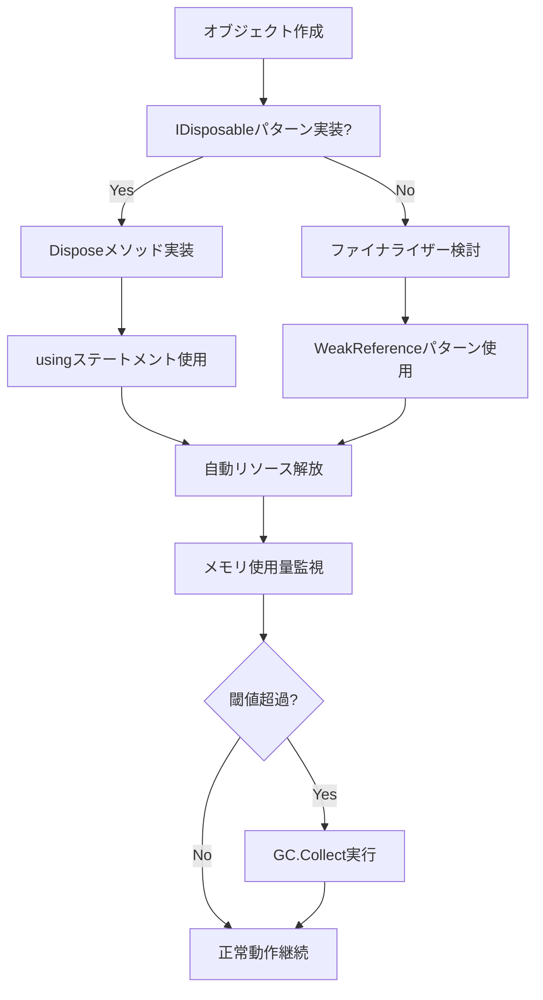

---

これらのアクティビティ図は、BeatSyncアプリケーションの主要な処理フローと意思決定ポイントを視覚的に表現しています。新しい開発者がアプリケーションの動作を理解し、デバッグや機能拡張を行う際の参考として活用してください。