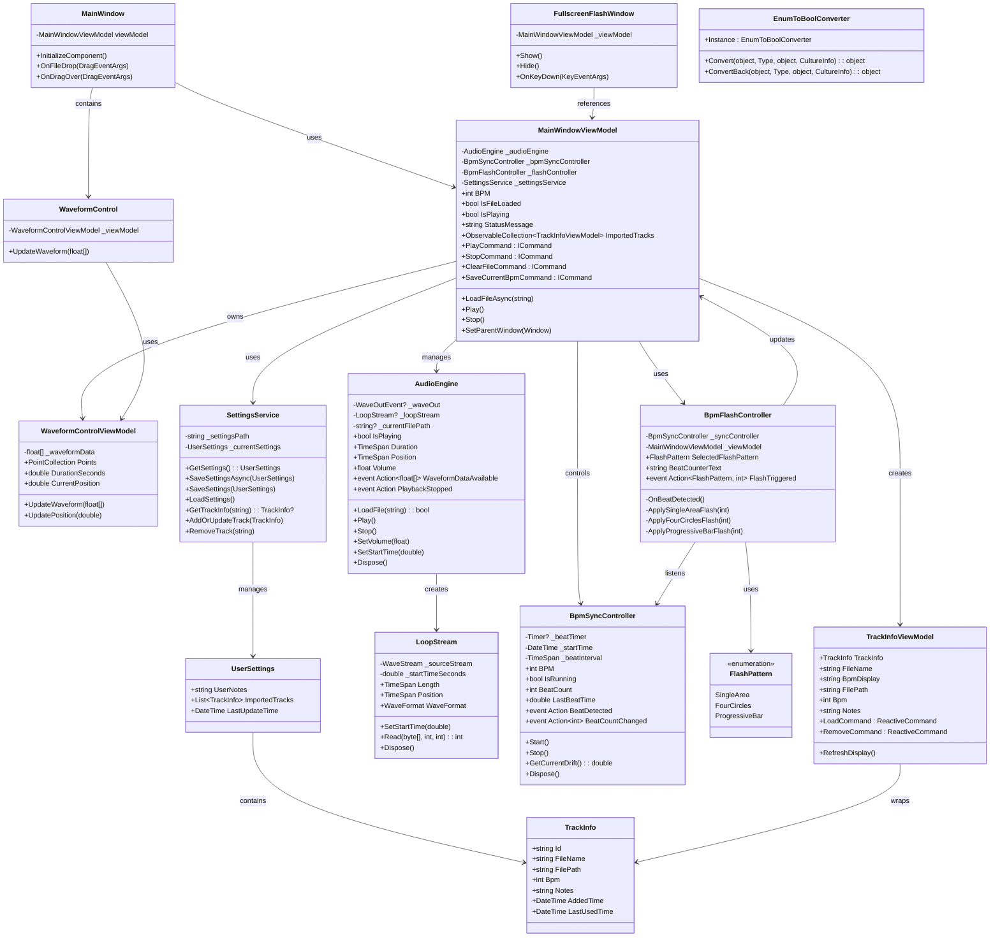

# 🗂️ BeatSync クラス図

## 全体クラス構造



## 詳細クラス設計

### 1. UI Layer クラス

#### MainWindowViewModel
**役割**: アプリケーションのメインロジック制御
**パターン**: MVVM, Observer, Command

```csharp
public class MainWindowViewModel : ReactiveObject, IDisposable
{
    // Fields
    private AudioEngine _audioEngine;
    private BpmSyncController _bpmSyncController;
    private BpmFlashController _flashController;
    private SettingsService _settingsService;
    
    // Observable Properties
    public int BPM { get; set; }
    public bool IsFileLoaded { get; private set; }
    public bool IsPlaying { get; private set; }
    public string StatusMessage { get; set; }
    public ObservableCollection<TrackInfoViewModel> ImportedTracks { get; }
    
    // Commands
    public ICommand PlayCommand { get; }
    public ICommand StopCommand { get; }
    public ICommand ClearFileCommand { get; }
    public ICommand SaveCurrentBpmCommand { get; }
    
    // Methods
    public async Task LoadFileAsync(string filePath);
    public void Play();
    public void Stop();
}
```

#### TrackInfoViewModel
**役割**: 楽曲情報の表示とコマンド処理
**パターン**: MVVM, Command

```csharp
public class TrackInfoViewModel : ReactiveObject
{
    public TrackInfo TrackInfo { get; }
    
    // Computed Properties
    public string FileName => TrackInfo.FileName;
    public string BpmDisplay => $"{TrackInfo.Bpm} BPM";
    public int Bpm => TrackInfo.Bpm;
    
    // Commands
    public ReactiveCommand<Unit, Unit> LoadCommand { get; }
    public ReactiveCommand<Unit, Unit> RemoveCommand { get; }
    
    // Events
    public event Action<TrackInfoViewModel>? LoadRequested;
    public event Action<TrackInfoViewModel>? RemoveRequested;
}
```

### 2. Audio Layer クラス

#### AudioEngine
**役割**: 音声ファイルの読み込み・再生制御
**パターン**: Factory, Observer

```csharp
public class AudioEngine : IDisposable
{
    private WaveOutEvent? _waveOut;
    private LoopStream? _loopStream;
    
    // Properties
    public bool IsPlaying => _waveOut?.PlaybackState == PlaybackState.Playing;
    public TimeSpan Duration => _loopStream?.Length ?? TimeSpan.Zero;
    public TimeSpan Position => _waveOut?.GetPosition() ?? TimeSpan.Zero;
    
    // Events
    public event Action<float[]>? WaveformDataAvailable;
    public event Action? PlaybackStopped;
    
    // Methods
    public bool LoadFile(string filePath);
    public void Play();
    public void Stop();
    public void SetVolume(float volume);
    public void SetStartTime(double seconds);
}
```

#### LoopStream
**役割**: 指定時間からのループ再生
**パターン**: Decorator, Stream

```csharp
public class LoopStream : WaveStream
{
    private readonly WaveStream _sourceStream;
    private double _startTimeSeconds;
    
    // Properties
    public override WaveFormat WaveFormat => _sourceStream.WaveFormat;
    public override long Length => _sourceStream.Length;
    public override long Position { get; set; }
    
    // Methods
    public void SetStartTime(double seconds);
    public override int Read(byte[] buffer, int offset, int count);
}
```

### 3. Sync Layer クラス

#### BpmSyncController
**役割**: 高精度BPM同期制御
**パターン**: Observer, State

```csharp
public class BpmSyncController : IDisposable
{
    private Timer? _beatTimer;
    private DateTime _startTime;
    private TimeSpan _beatInterval;
    
    // Properties
    public int BPM { get; set; }
    public bool IsRunning { get; private set; }
    public int BeatCount { get; private set; }
    
    // Events
    public event Action? BeatDetected;
    public event Action<int>? BeatCountChanged;
    
    // Methods
    public void Start();
    public void Stop();
    public double GetCurrentDrift();
    private void OnTimerElapsed(object? state);
}
```

#### BpmFlashController
**役割**: フラッシュパターンの実行制御
**パターン**: Strategy, Observer

```csharp
public class BpmFlashController
{
    private readonly BpmSyncController _syncController;
    private readonly MainWindowViewModel _viewModel;
    
    // Properties
    public FlashPattern SelectedFlashPattern { get; set; }
    public string BeatCounterText { get; private set; }
    
    // Events
    public event Action<FlashPattern, int>? FlashTriggered;
    
    // Methods
    private void OnBeatDetected();
    private void ApplySingleAreaFlash(int beatNumber);
    private void ApplyFourCirclesFlash(int beatNumber);
    private void ApplyProgressiveBarFlash(int beatNumber);
}
```

### 4. Services Layer クラス

#### SettingsService
**役割**: アプリケーション設定とデータの永続化
**パターン**: Repository, Singleton

```csharp
public class SettingsService
{
    private const string SettingsFileName = "beatsync_settings.json";
    private readonly string _settingsPath;
    private UserSettings _currentSettings;
    
    // Methods
    public UserSettings GetSettings();
    public async Task SaveSettingsAsync(UserSettings settings);
    public void SaveSettings(UserSettings settings);
    public void LoadSettings();
    public TrackInfo? GetTrackInfo(string filePath);
    public void AddOrUpdateTrack(TrackInfo trackInfo);
    public void RemoveTrack(string filePath);
}
```

### 5. Data Layer クラス

#### UserSettings
**役割**: アプリケーション設定データの構造定義
**パターン**: Data Transfer Object

```csharp
public class UserSettings
{
    [JsonPropertyName("userNotes")]
    public string UserNotes { get; set; } = string.Empty;
    
    [JsonPropertyName("importedTracks")]
    public List<TrackInfo> ImportedTracks { get; set; } = new();
    
    [JsonPropertyName("lastUpdateTime")]
    public DateTime LastUpdateTime { get; set; }
}
```

#### TrackInfo
**役割**: 楽曲情報データの構造定義
**パターン**: Data Transfer Object

```csharp
public class TrackInfo
{
    [JsonPropertyName("id")]
    public string Id { get; set; } = string.Empty;
    
    [JsonPropertyName("fileName")]
    public string FileName { get; set; } = string.Empty;
    
    [JsonPropertyName("filePath")]
    public string FilePath { get; set; } = string.Empty;
    
    [JsonPropertyName("bpm")]
    public int Bpm { get; set; } = 120;
    
    [JsonPropertyName("notes")]
    public string Notes { get; set; } = string.Empty;
    
    [JsonPropertyName("addedTime")]
    public DateTime AddedTime { get; set; }
    
    [JsonPropertyName("lastUsedTime")]
    public DateTime LastUsedTime { get; set; }
}
```

## クラス間相互作用

### 依存関係グラフ
```
MainWindowViewModel
    ├── AudioEngine
    │   └── LoopStream
    ├── BpmSyncController
    ├── BpmFlashController
    │   ├── BpmSyncController (参照)
    │   └── FlashPattern
    ├── SettingsService
    │   └── UserSettings
    │       └── TrackInfo
    ├── TrackInfoViewModel
    │   └── TrackInfo (参照)
    └── WaveformControlViewModel
```

### イベントフロー
```
BpmSyncController.BeatDetected
    ↓
BpmFlashController.OnBeatDetected
    ↓
MainWindowViewModel UI更新
```

### データフロー
```
ユーザー操作
    ↓
MainWindowViewModel
    ↓
SettingsService
    ↓
UserSettings (JSON永続化)
```

## 設計パターンの適用

### 1. MVVM Pattern
- **View**: XAML ファイル
- **ViewModel**: MainWindowViewModel, TrackInfoViewModel
- **Model**: UserSettings, TrackInfo

### 2. Observer Pattern
- **Subject**: BpmSyncController, AudioEngine
- **Observer**: BpmFlashController, MainWindowViewModel

### 3. Command Pattern
- **Command**: ReactiveCommand
- **Invoker**: UI要素（Button等）
- **Receiver**: ViewModel メソッド

### 4. Factory Pattern
- **Factory**: AudioEngine (WaveStream生成)
- **Product**: 各種WaveStreamオブジェクト

### 5. Repository Pattern
- **Repository**: SettingsService
- **Entity**: UserSettings, TrackInfo
- **Data Source**: JSON ファイル

### 6. Strategy Pattern
- **Strategy**: FlashPattern enum
- **Context**: BpmFlashController
- **Concrete Strategy**: 各フラッシュ実装メソッド

## クラス拡張ガイドライン

### 新しいフラッシュパターン追加
1. `FlashPattern` enumに新しい値を追加
2. `BpmFlashController`に対応するメソッドを追加
3. UIに選択ボタンを追加

### 新しい音声フォーマット対応
1. `AudioEngine.LoadFile`にフォーマット判定ロジック追加
2. 必要に応じて新しいStreamクラス作成
3. ファイルフィルターを更新

### 新しいUI機能追加
1. 対応するViewModelプロパティ追加
2. ReactiveCommandの実装
3. XAMLでのバインディング設定

---

このクラス図は、BeatSyncアプリケーションの全体的なクラス構造と相互関係を示しています。新しい開発者がコードベースを理解し、適切な拡張を行う際の参考として活用してください。